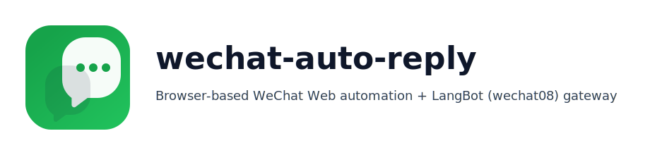

<p align="center">
  
</p>

<p align="center">
  <a href="LICENSE"></a>
  
  
</p>

# wechat-auto-reply 🚀💬

一个通过 **网页微信 + 浏览器自动化（Selenium）** 实现的微信自动监控与自动回复服务，并提供与 **LangBot（`wechat08` 平台适配器）** 对接的 **HTTP + WebSocket 网关** 🧩

本项目的核心定位是：**用浏览器模拟真实用户操作来完成登录、收消息、发消息**。相比“抓包/逆向协议/私有 API”的方式，这种方案更容易在技术评审与合规沟通中说明实现路径（但仍需遵守微信/企业的使用规范，详见下方声明）。

## 选择版本（V1 / V2）

- **V2（推荐）**：`wechat_auto_service_v2/` ✅
  - 作为 wechat08 兼容网关接入 LangBot（WS 收消息 + HTTP 发送）
  - 回复链路更适合生产部署（发送入队即返回，避免 LangBot 10s 超时）⏱️
  - 一键启动：`./start_wechat_auto_v2.sh start`
- **V1（Legacy）**：本仓库根目录 `main.py` + `config.json`（本地直连 LLM 自回复）🧪
  - 适合单机快速跑通（不接 LangBot）
  - 详细说明与结构见：`README_V1.md`

## 架构简介（强调：通过浏览器实现）

**关键点：消息来源与发送都来自 `wx.qq.com` 的 UI/DOM，而不是直接接入微信内部消息流。**

```
手机微信扫码登录
      │
      ▼
Chrome 打开 wx.qq.com（持久化 profile 维持登录态）
      │
      ▼
Selenium(WebMonitor) 轮询未读红点 / 活跃会话 DOM
  - 提取新消息文本
  - 过滤（黑/白名单、群 @ 规则、关键词）
  - 将消息推送到 v2 网关 WS（wechat08 兼容）
      │
      ▼
LangBot wechat08 平台适配器（WS 收消息 → LLM/插件流水线）
      │
      ▼
LangBot 调用 v2 网关 HTTP /api/Msg/SendTxt 发回复
      │
      ▼
v2 网关将“发送任务”入队（异步，不阻塞 LangBot）
      │
      ▼
Selenium 选择会话 → 输入 → Enter 发送（必要时处理弹窗/重试）
```

### 为什么“走浏览器”通常更稳妥

- **不做协议逆向**：不需要抓取/复刻微信内部通信协议与加密参数，维护成本更低。
- **行为路径更接近人工**：通过网页端 UI 完成操作，通常比非官方协议调用更不容易被识别为“异常 API 客户端”（不构成任何保证）。
- **合规更容易解释**：从审计角度，技术方案是“操作官方网页端”，而非“绕过官方渠道访问内部接口”。

### 合规与风险说明（重要）

- 本项目**不属于微信官方 SDK/接口**，且依赖网页端页面结构，可能随微信网页端更新而失效。
- 请确保使用场景符合微信及企业相关制度，不要用于群发骚扰、营销滥发等行为。
- “更接近人工操作”并不代表“不会触发风控”，也不代表“合规无风险”。是否合规最终取决于你的业务场景、权限、内容与使用方式。

## 快速开始（推荐：v2 + LangBot）

### 1) 启动 v2 网关（扫码登录 + 自动监控）

在本仓库目录执行：

```bash
./start_wechat_auto_v2.sh install
./start_wechat_auto_v2.sh start
```

常用命令：

- `./start_wechat_auto_v2.sh restart`：一键重启（会关闭占用 profile 的残留 Chrome 进程，解决“Chrome instance exited”等问题）
- 健康检查：`curl http://127.0.0.1:8059/health`

配置文件：
- `wechat_auto_service_v2/config.json`（首次启动会从 `wechat_auto_service_v2/config.example.json` 复制生成）

### 2) 配置 LangBot 使用 wechat08 平台适配器

LangBot 侧使用其内置的 `wechat08` 平台（无需你在 LangBot 里写新 adapter），只需要把网关地址指向本项目。

**如果 LangBot 运行在 Docker 里**（最常见）：
- `wechat08_api_base`: `http://host.docker.internal:8059/api`
- `wechat08_ws_base`: `ws://host.docker.internal:8088/ws`

**如果 LangBot 与本项目都运行在宿主机**：
- `wechat08_api_base`: `http://127.0.0.1:8059/api`
- `wechat08_ws_base`: `ws://127.0.0.1:8088/ws`

`wxid` 需要与 `wechat_auto_service_v2/config.json` 的 `bot.wxid` 一致（Selenium 模式下无法稳定获得真实 wxid，这里采用约定值）。

### 3) 验证链路是否通

1. v2 启动后，看 `logs/wechat_auto_v2.out` 是否出现：
   - `WeChat automation started.`
   - `Uvicorn running on ...:8059` / `...:8088`
2. LangBot 启动后，看它是否能连上 WS（无 `Connection refused`）
3. 当有新消息时，v2 会通过 WS 推给 LangBot；LangBot 生成回复后会调 `SendTxt`

调试发送任务状态（可选）：
- `GET http://127.0.0.1:8059/api/Msg/SendTxtStatus?jobId=1`

## 详细操作手册（LangBot 配合）

请阅读：`README_LANGBOT_INTEGRATION.md`

---

## Legacy（可选）

仓库仍保留 `main.py`（旧版：浏览器自动化 + 直接调用 LLM 自动回复 + 记录导出）。如果你只需要“本地自回复”且不接 LangBot，可以继续使用旧版。

旧版详细说明（部署/结构/优缺点）：`README_V1.md` 📘

## License

MIT License. See `LICENSE`.
